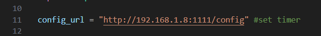
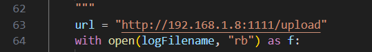
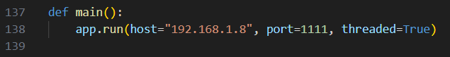
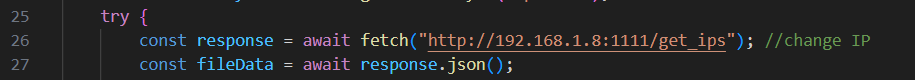
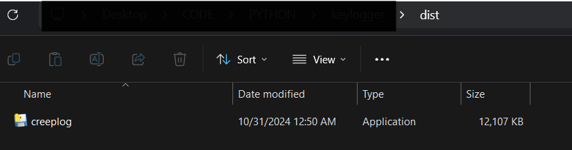
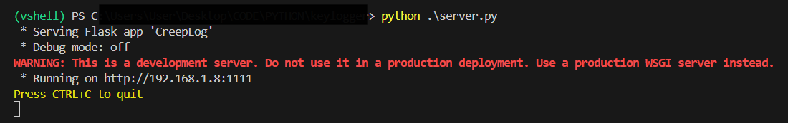
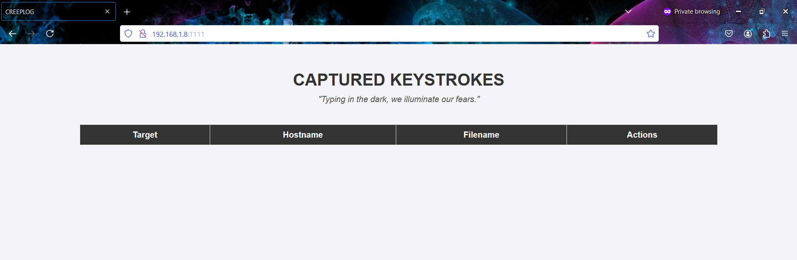
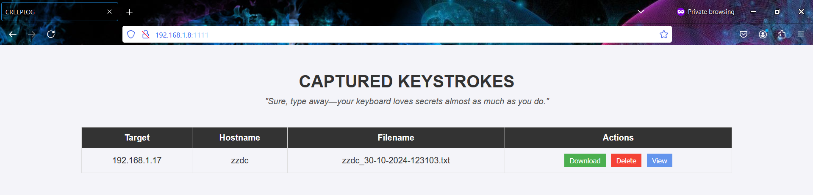

> **⚠️ WARNING:** This tool is intended for **educational and ethical cybersecurity use only**. Unauthorized use of CreepLog on systems you do not own or do not have permission to monitor is illegal and may have serious legal consequences. Use this tool responsibly.


# 🛠️ **SETTING UP THE KEYLOGGER SCRIPT**

CreepLog is designed to capture keystrokes on a target Windows machine, upload the logs to a remote server at regular intervals, and then perform a self-destruct to erase any traces.

To configure CreepLog for operation, specify the IP address where the logs will be sent:

1. **Open the `creeplog.py` file.**
2. **Configure the Attacker’s IP Address:**
    - **Line 11**: Replace the default IP with the attacker IP where the server script will be hosted.



3. **Repeat the IP Configuration:**
	- **Line 63**: Update this line with the attacker’s IP, similar to Line 11



4. Save the changes.

---

# 🌐 **SETTING UP THE SERVER**

To receive the keystroke logs from the target machine, configure and run the server.

1. **Open `server.py`.**
    - **Line 138**: Modify the IP address to bind the server to the attacker’s IP.



2. **Optional**: Change the default port if necessary.

---

# 💻 **SETTING UP THE UI**

CreepLog's web interface is already configured, but you need to update the IP in the JavaScript file.

1. **Open `/static/js/index.js`.**
    - **Line 26**: Change the URL to the attacker’s IP address.



---

# 🗃️ **CREATING AN EXECUTABLE FOR THE TARGET**

To deploy CreepLog on a Windows target machine, create a standalone executable using **PyInstaller**.

1. **Open a terminal** in your project directory.
2. **Generate the Executable:** Run the following command to package CreepLog into a Windows executable:

```python
pyinstaller --onefile --noconsole --hidden-import=keyboard creeplog.py
```
_Note: Run this command on a Windows machine to create a Windows-compatible executable._

3. **Locate the Executable**:
    - PyInstaller will generate multiple files. Find the `creeplog.exe` file in the `/dist` folder.



4. **Transfer the Executable to the Target**:
	- Copy this file to the target machine, and it’s ready for use ;)

---

# 📝 **EXAMPLE OF KEY LOGGING**

### **Starting the Server**

1. **Run the server** on your machine to receive the keystroke logs.

```
python server.py
```
(Use `python3` if there are compatibility issues.)





### **Executing the Keylogger on the Target Machine**

- **Run the executable** on the target machine.
- **Observe Logging Results**:
    - As the target types, keystrokes are recorded.
    - After the set timer (default: 1 minute), logs appear on the web interface.



### **ACCESSING AND MANAGING LOGS**

- **View Logs**: Open the web interface to see available logs.
- **Download or Delete Logs**: Use the interface to download or delete log files as needed.
- After execution, CreepLog automatically deletes the generated log file and itself from the target machine, leaving no traces behind.

---
